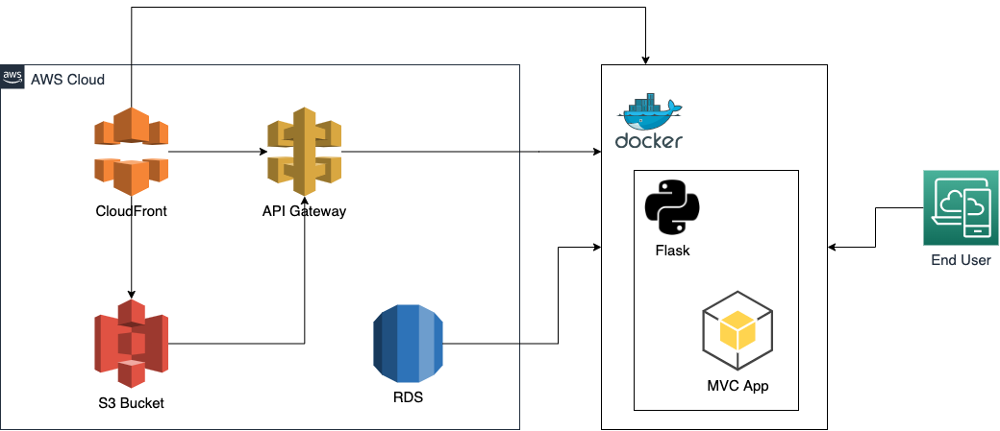
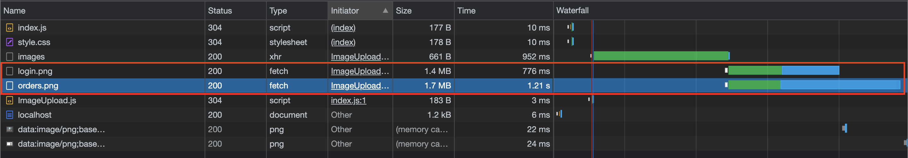
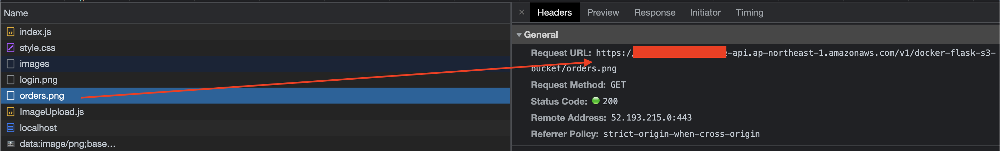
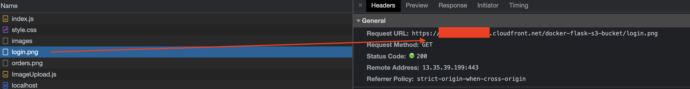

# ABOUT

This is a minimal docker image runs flask connects to AWS and uses `RDS`/`S3`/`API Gateway`/`CloudFront`/etc. Details are shown below in [FUNCTION](#function) and [PROFILER](#profiler) area.

## ARCHITECTURE

This architecture aims to provide a handy way to deploy an app, you can completely remove docker based backend server and replace by a serverless method instead. 

- 

## DEPENDENCIE

1. An AWS Free-tier account
2. Knowledge of [S3/RDS/CloudFront/API Gateway](#useful-links)
3. Docker
4. Patience

## RUN

```shell=
$ cp ./.env.example ./.env && vim ./.env # first of all, you need to edit enviroment varibales to yours
$ chmod 777 ./deploy.sh
$ ./deploy.sh
```

# FUNCTION

## TODO

-   [x] Upload/download images to/from S3 from API Gateway deployed on AWS
-   [x] RDS to store image path data
-   [x] Single domain with CloudFront CDN service

## ENDPOINT ACCESS

-   S3 (only `get` and `put` are allowed): https://euqn60nqt1.execute-api.ap-northeast-1.amazonaws.com/v1/docker-flask-s3-bucket/test.png
-   RDS: docker-flask-db.ccct0eee47fu.ap-northeast-1.rds.amazonaws.com
-   CloudFront: https://d1w4is3fbx4jrr.cloudfront.net/

## PROFILER

I uses two method: API Gateway alongside and Cloudfront + API Gateway to request for images which are stored in S3 service. Below images compare two methods and can find: CDN response images to requests more effitively.

  
  


# USEFUL LINKS

-   [Amazon Relational Database Service](https://docs.aws.amazon.com/zh_tw/AmazonRDS/latest/UserGuide/USER_CreateDBInstance.html)
-   [How do I upload an image file to Amazon S3 through API Gateway?](https://aws.amazon.com/premiumsupport/knowledge-center/api-gateway-upload-image-s3/)
-   [Create a REST API as an Amazon S3 proxy in API Gateway](https://docs.aws.amazon.com/zh_tw/apigateway/latest/developerguide/integrating-api-with-aws-services-s3.html)
-   [Connect Amazon RDS database with a Flask application](https://storytell.ddns.net/blog/3)
-   [Use CloudFront for API Gateway & S3](https://medium.com/vectoscalar/use-cloudfront-for-api-gateway-s3-both-cc0e30e0962a)
-   [How to set up a CloudFront distribution for Amazon S3](https://aws.amazon.com/cloudfront/getting-started/S3/)
